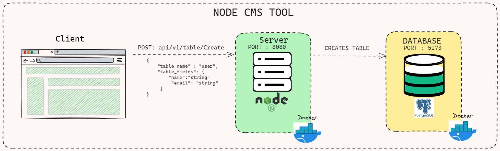

# Node CMS Tool

Create a very rudimenatary headless CMS with extremely basic CRUD functionality. You can imagine this to be an extremely basic version of strapi.js. As an end user, when I run your project, I should be able to create different entities from the frontend by specifying its attributes and their types. (Eg. Person is an entity with attributes name<string>, email<string>, mobileNumber<number>, dateOfBirth<Date>). When an entity is created from frontend, the app should automatically create a table definition, depending on the attributes in an RDMBS (mysql or postgresql only). After creating an entity, I should be able to Create, Read, Update and Delete data in that entity from the frontend itself. (Eg. I should be able to create an entry in the Person entity using name as Ketan, ketan@test.com as the email, 9876543210 as the mobile number and 1-Jan-1990 as the date of birth. I should be able to add, update existing entry, view created entries and delete an existing entry.)

# 🏛️ Proposed Architecture

# 📹 Demo Video
https://www.loom.com/share/c0a3b98ebde24bc4a52997f0d3109feb?sid=8c967e68-77ee-4334-94d5-34d42d3c18d8

# Sample Response 

table_name: Person
table_fields: {
    "name": "string",
    "email": "string",
    "mobileNUmber": "integer",
    "dateOfBirth": "string",
}

sample Entry 
{
    "name": "Ketan",
    "email": "ketan@gmail.com",
    "mobileNUmber": "9876543210",
    "dateOfBirth": "1-Jan-1990"
}
